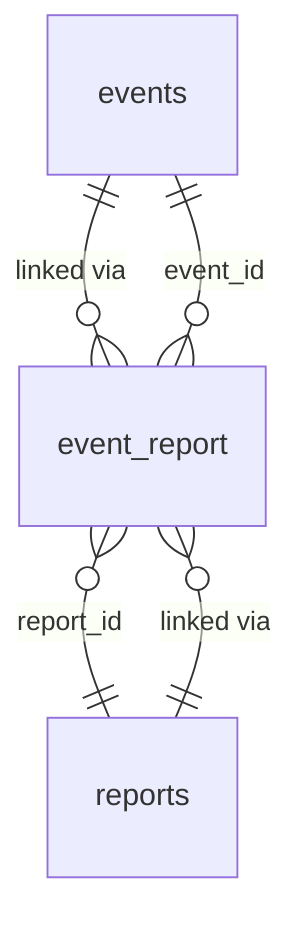

# Database schema: events & reports

Frontend PostgreSQL schema for outbreak events and related news reports. Defined in Laravel migrations under `database/migrations/`.

## Relationships

- **Event ↔ Report**: many-to-many via `event_report` (composite primary key, cascade delete on both sides).

---

## `events`

Structured outbreak / surveillance case records shown on the dashboard map.

| Column | Type | Nullable | Index | Notes |
|--------|------|----------|-------|-------|
| `id` | bigint | no | PK | Auto-increment |
| `disease` | string | no | | Disease code or label (e.g. HPAI) |
| `subtype` | string | yes | | Pathogen subtype |
| `species` | string | yes | | Affected species |
| `population` | string | yes | | Population type (wild, poultry, captive, …) |
| `source` | string | no | | Data source identifier |
| `external_id` | string | yes | yes | External reference ID |
| `occurred_at` | timestamp | no | yes | Event / confirmation datetime |
| `admin_level_1` | string | yes | yes | Canton / admin level 1 |
| `admin_level_2` | string | yes | | Admin level 2 |
| `admin_level_3` | string | yes | | Admin level 3 |
| `latitude` | decimal(9,6) | yes | composite | WGS84 latitude |
| `longitude` | decimal(9,6) | yes | composite | WGS84 longitude |
| `cases` | unsigned int | yes | | Case count |
| `deaths` | unsigned int | yes | | Death count |
| `susceptible` | unsigned int | yes | | Susceptible count |
| `distance_km` | decimal(8,2) | yes | | Distance from reference point (Bern) |
| `relevance_score` | decimal(5,2) | yes | | Computed relevance index |
| `priority` | unsigned tinyint | yes | | `EventPriority` enum (see below) |
| `created_at` | timestamp | no | | |
| `updated_at` | timestamp | no | | |

**Indexes:** `(latitude, longitude)`, `external_id`, `occurred_at`, `admin_level_1`.

**Model casts:** `occurred_at` → datetime; `latitude` / `longitude` → decimal; `distance_km` / `relevance_score` → decimal; `priority` → `EventPriority`.

**Hidden from default serialization:** `distance_km`, `relevance_score`, `priority` (exposed selectively via API resources).

### `EventPriority`

Backed integer enum (`App\Enums\EventPriority`):

| Value | Name |
|-------|------|
| 1 | Low |
| 2 | Medium |
| 3 | High |
| 4 | Critical |

---

## `reports`

News / unstructured source articles linked to events.

| Column | Type | Nullable | Index | Notes |
|--------|------|----------|-------|-------|
| `id` | bigint | no | PK | Auto-increment |
| `source` | string | no | | Data source identifier (e.g. `gefluegelnews`, `padi_web`) |
| `title` | string | no | | Article headline |
| `url` | string | yes | | Canonical article URL |
| `teaser` | string | yes | | Short excerpt / lead |
| `body` | longText | yes | | Full article text |
| `report_date` | date | no | | Publication date |
| `admin_level_1` | string | yes | yes | Geographic admin level 1 |
| `admin_level_2` | string | yes | | Admin level 2 |
| `admin_level_3` | string | yes | | Admin level 3 |
| `relevance_score` | decimal(5,2) | yes | | Numeric relevance index |
| `relevance_score_string` | string | yes | | Categorical relevance (e.g. high, medium, low) |
| `distance_km` | decimal(8,2) | yes | | Distance from reference point |
| `created_at` | timestamp | no | | |
| `updated_at` | timestamp | no | | |

**Indexes:** `admin_level_1`.

**Model casts:** `report_date` → date; `relevance_score` / `distance_km` → decimal.

**Hidden from default serialization:** `distance_km`.

---

## `event_report`

Pivot table linking events to related reports.

| Column | Type | Nullable | Notes |
|--------|------|----------|-------|
| `event_id` | bigint | no | FK → `events.id`, cascade on delete |
| `report_id` | bigint | no | FK → `reports.id`, cascade on delete |
| `created_at` | timestamp | no | |
| `updated_at` | timestamp | no | |

**Primary key:** `(event_id, report_id)`.

---

## Migrations

| File | Table |
|------|-------|
| `2026_05_29_000005_create_sources_table.php` | `sources` |
| `2026_05_29_000006_create_events_table.php` | `events` |
| `2026_05_29_000007_create_reports_table.php` | `reports` |
| `2026_05_29_000008_create_event_report_table.php` | `event_report` |
